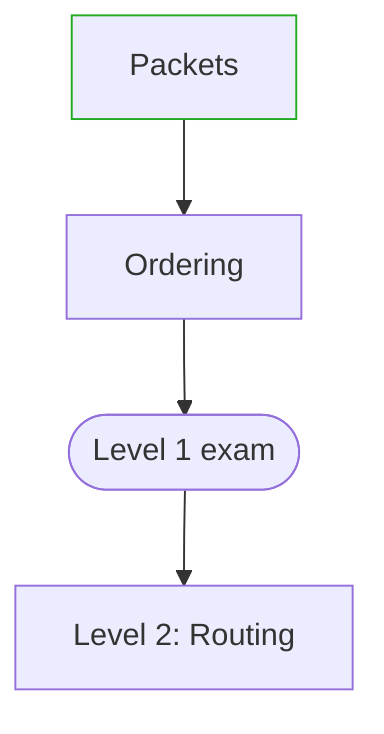

# Toolbox — Design (v1.5)

Status: v1 accepted 2026-09-09; v1.1 delta accepted 2026-09-11; v1.2 delta accepted 2026-09-12; v1.3 delta accepted 2026-09-12; v1.4 delta accepted 2026-09-18; v1.5 delta accepted 2026-09-22; teach-path §26–§27 accepted 2026-09-29
Date: 2026-09-22
Source of truth for requirements: `docs/requirements.md`. This file answers
the "how" for every §14 open point and every command in §8, plus the v1.1
delta in requirements §15, the v1.2 delta in requirements §17, the
v1.3 delta in requirements §19, the v1.4 delta in requirements §21, and
the v1.5 delta in requirements §23.
It does
not restate rationale already recorded in
`docs/adr/0001-*.md` through `docs/adr/0010-*.md` — those are cited, not
re-argued.
v1 sections below stay as accepted; v1.1 is §14–§15; v1.2 is §16–§17;
v1.3 is §18–§19; v1.4 is §20–§21; v1.5 is §22–§23; v1.6 is §24–§25.
§26–§27 are the teach path, accepted 2026-09-29 (requirements §27–§28, ADR 0012, ADR 0013).

## 1. Path resolution

`tb` resolves `TOOLBOX_HOME` exactly once per invocation, in `main`, before
dispatching to any subcommand:

1. If the environment variable `TOOLBOX_HOME` is set and non-empty, use it
   verbatim (after `filepath.Clean`).
2. Otherwise use `filepath.Join(os.UserHomeDir(), "toolbox")`.
3. `os.Stat` the resolved path. If it does not exist or is not a directory,
   fail immediately: exit 1, message
   `tb: toolbox home "<path>" not found (from $TOOLBOX_HOME or default ~/toolbox)`.
   No subcommand runs without a valid toolbox home — even `tb doctor`, which
   instead reports this as its first failing check (doctor catches the
   error itself and renders it as a report line; it does not hard-exit
   before printing the rest of the one-screen report — see §5.3).

The resolved value is carried as a single `paths.Toolbox` string, passed
down to every package that needs it (`config`, `scaffold`, `render`,
`agents`). No package re-reads the environment.

## 2. Repo tree

```
$TOOLBOX_HOME/                     # this repo
  AGENTS.md                        # toolbox's own short rules (hand-written)
  toolbox.toml                     # toolbox-side config (schema: §3.2)
  profiles/
    rust-systems.toml
    infra-go.toml
  personas/
    default.md
  skills/
    spec/SKILL.md
    adr/SKILL.md
    onboard/SKILL.md
    scout/SKILL.md
    handoff/SKILL.md
    rust-verify/SKILL.md
    rust-systems/SKILL.md
    go-verify/SKILL.md
    infra-go/SKILL.md
    aws-guard/SKILL.md
  templates/
    AGENTS.md                      # managed-region skeleton, §4
    docs/requirements.md
    docs/design.md
    docs/tasks.md
    docs/session.md
    docs/adr/0000-template.md
  bin/                              # optional user scripts, not installed by tb
  cmd/tb/                           # Go module
    go.mod
    main.go
    internal/
      paths/                        # §1
      config/                       # §3: toolbox.toml + profiles/*.toml reader
      agents/                       # §7: detection
      render/                       # §4: AGENTS.md managed-region rendering
      scaffold/                     # §8.2: docs/ template materialization
      cli/                          # subcommand implementations, §5
```

Every directory's role matches §5 of requirements; nothing renamed. The Go
module lives under `cmd/tb/` specifically so `go build ./...` and `gofmt`
never walk `skills/`, `profiles/`, or `personas/` — those are markdown/TOML
content, not Go source.

## 3. Config schema

### 3.1 Parser subset (shared by both file kinds)

`internal/config` implements one small reader for this closed grammar:

- Line comments starting with `#`, blank lines ignored.
- Bare (unquoted) keys, `=`, then one of:
  - a double-quoted string: `profile = "rust-systems"`
  - a flat array of double-quoted strings, no nesting: `skills = ["spec",
    "adr", "onboard"]`. Like real TOML, newlines inside the brackets are
    insignificant, so the array may span multiple lines up to its closing
    `]` — `profiles/*.toml` (§3.3) relies on this to keep long skill lists
    readable.
- One `[section]` header form, used only by `profiles/*.toml` (`[verify]`
  holds free-form string keys for the verify recipe summary — see 3.3).
- No inline tables, no multi-line strings, no numbers, no dates, no nested
  arrays.

Anything else is a parse error: `<file>:<line>: unsupported syntax: <text>`.
This is intentionally strict — ADR 0001 accepts that `tb` never needs to
read arbitrary TOML, only the subset it itself writes and the profile files
this design defines below.

### 3.2 Product-repo `toolbox.toml`

```toml
# Written by `tb init`. Safe to hand-edit the `profile` line; the other
# two lines are refreshed by --force.
profile = "rust-systems"
toolbox_version = "0.1.0"
generated_by = "tb init"
```

`profile` is the only field `tb` reads back (on every subsequent command
run from that repo, e.g. `tb doctor`). The other two are informational.

### 3.3 `profiles/<name>.toml`

```toml
name = "rust-systems"
description = "Systems / low-level Rust, greenfield and legacy"
persona = "default"                       # personas/<persona>.md
skills = [
  "spec", "adr", "onboard", "scout", "handoff",
  "rust-verify", "rust-systems",
]
templates = ["AGENTS.md", "docs/requirements.md", "docs/design.md",
             "docs/tasks.md", "docs/session.md", "docs/adr/0000-template.md"]

[verify]
summary = "cargo test; cargo clippy -- -D warnings; miri when unsafe changed"
```

`templates` lists paths relative to `templates/`, materialized relative to
the product repo root (§6). `[verify].summary` is a one-line string
rendered into the AGENTS.md managed region (§4) — it is documentation only;
`tb` never executes it (§11, non-goal "wrapping verify as `tb verify`").

### 3.4 Resolution order failure

If `toolbox.toml` in a product repo names a `profile` with no matching
`profiles/<name>.toml` in `$TOOLBOX_HOME`, every command that needs the
profile (`init`, `doctor`) fails with
`tb: profile "<name>" not found in <TOOLBOX_HOME>/profiles`.

## 4. AGENTS.md rendering and merge

Mechanism fixed by ADR 0002. The managed region template
(`templates/AGENTS.md`) is:

```
<!-- toolbox:begin -->
<!-- Generated by tb init. Do not hand-edit between these markers;
     tb init --force replaces this region on every run. -->
Profile: {{.Profile}}
Persona: {{.PersonaPlanTitle}} / {{.PersonaImplementTitle}}
Skills: {{.SkillList}}
Verify: {{.VerifySummary}}
Language: English for code, identifiers, comments, commits, ADRs, and docs.
Chat may be Spanish if the user writes Spanish.
<!-- toolbox:end -->
```

Rendering is a plain `text/template` execution over a struct built from the
loaded profile + persona section titles (parsed from `personas/default.md`
by reading its two `##` headings) + the flattened skill list, joined with
`, `. Output must be deterministic: same profile + same toolbox content ⇒
byte-identical region, so re-running `init` twice with no changes produces
no diff.

Full decision table (mechanics already fixed by ADR 0002, restated here as
the implementation spec `internal/render` follows):

| State on disk | Interactive | Non-interactive | `--force` |
|---|---|---|---|
| No `AGENTS.md` | write full file, no prompt | write full file, no prompt | write full file |
| Exists, no markers | prompt: merge (prepend region) / refuse | refuse, exit 1 | insert region at top, keep rest |
| Exists, markers found | prompt: merge (replace region only) / refuse | refuse, exit 1 | replace region only |

"Refuse" prints the region that *would* have been written to stdout (so the
user can copy it by hand) and exits 1 without touching the file.
Interactivity is detected with stdlib only (ADR 0001 rules out
`golang.org/x/term`, which the original draft of this section
mistakenly named): `os.Stdin.Stat()` and a check of the
`os.ModeCharDevice` bit on the result, with one correction found while
implementing group 4 — `/dev/null` is itself a character device, so a
bare `ModeCharDevice` test misreads `tb init </dev/null` (a common way
scripts and CI mark a command non-interactive) as interactive, which
would print a prompt and then block reading stdin instead of refusing.
`os.SameFile` against `os.DevNull` rules that specific case out. This
is still not a full TTY check — a redirect from some other character
device would still read as interactive — which is an accepted v1 gap.

## 5. Command specs

Global flag: `--profile` / `-p`, parsed by each subcommand's own
`flag.FlagSet` that needs it (`init`; `doctor` accepts it optionally to
override profile detection when `toolbox.toml` is absent, for a
pre-`init` sanity check). Exit codes throughout: `0` success (incl. "one
agent missing" warning), `1` operational failure, `2` usage error (bad
flags, missing required flag).

### 5.1 `tb install`

1. Resolve toolbox home (§1).
2. Detect agents (§7) — **before** step 3 creates anything. ADR 0003's
   config-dir signal is "`$HOME/.claude` exists"; step 3's
   `os.MkdirAll(~/.claude/skills, ...)` creates that parent directory as
   a side effect, so detecting after step 3 would make every install
   self-fulfillingly report both agents present. This ordering bug was
   found while implementing and testing group 4 (docs/tasks.md) and is
   why detection is listed before directory creation here, unlike an
   earlier draft of this section.
3. For each of `~/.claude/skills`, `~/.grok/skills`: `os.MkdirAll` if
   missing.
4. List `$TOOLBOX_HOME/skills/*` (directories containing `SKILL.md`). For
   each skill name, for each of the two target dirs:
   - target does not exist → `os.Symlink(source, target)`.
   - target is a symlink already pointing at `source` → leave it
     (idempotent, no-op).
   - target is a symlink pointing elsewhere → remove and relink.
   - target exists and is a real file/dir (not a symlink) → print
     `warn: <target> exists and is not managed by tb, skipping`, continue
     with the remaining skills (does not abort the run).
5. Using the presence from step 2: if both absent, print
   `error: neither Claude Code nor Grok Build detected`, exit 1 (skills
   were still linked — a later install with an agent present just
   succeeds). If exactly one absent: print
   `warn: <agent> not detected on this machine`, exit 0. If both present:
   proceed silently to the summary.
6. Print a summary: toolbox home, N skills linked per target, agent
   presence for both.

### 5.2 `tb init [-p|--profile <name>] [--force]`

1. Resolve toolbox home. Require `--profile`/`-p`; if absent, exit 2
   (`usage: tb init -p <rust-systems|infra-go>`).
2. Load `profiles/<name>.toml` (§3.4 for the not-found case).
3. Confirm cwd is inside a git repo (`git rev-parse --show-toplevel`); if
   not, exit 1: `tb init must run inside a git repository`.
4. Write/merge `toolbox.toml` at repo root per the same three-state table
   as AGENTS.md (no markers needed — it's a `tb`-owned file with one
   user-editable line, `profile`; interactive/refuse/`--force` behave the
   same as §4 but `--force` rewrites the whole file since only `profile` is
   ever hand-edited and it's preserved by reading the existing value first
   unless `-p` explicitly requests a different profile, in which case the
   new profile always wins).
5. Render/merge `AGENTS.md` per §4.
6. For each path in the profile's `templates` list: if the file does not
   exist at the corresponding repo-relative path, create parent dirs and
   copy the template verbatim. If it exists, leave it — untouched, no
   diffing, no prompt. `docs/adr/` gets its `0000-template.md` copied the
   same way (create-if-missing); no other file under `docs/adr/*` is ever
   written by `init`, satisfying "never overwrite existing ADRs" absolutely
   (not just under `--force`).
7. Print a summary: profile, files created, files left alone, files
   merged/refused.

### 5.3 `tb doctor` (read-only)

One-screen, fixed order:

1. Toolbox home: resolved path, exists Y/N (from §1's own error, caught
   and rendered as a line here rather than propagated).
2. `tb` on PATH: `exec.LookPath("tb")` — informational, never fails doctor.
3. Skill symlink health: for each skill in `$TOOLBOX_HOME/skills`, for each
   of the two target dirs, report `ok` / `missing` / `broken` (symlink
   exists but source doesn't) / `not managed` (real file present).
4. Agent detection (§7): Claude Code present Y/N, Grok Build present Y/N.
5. If cwd has `toolbox.toml`: profile name, whether `profiles/<name>.toml`
   resolves, whether `AGENTS.md` exists and has a managed region.
6. If the profile (from 5, or `-p` override) is `rust-systems`, warn if
   `cargo` is not on PATH; if `infra-go`, warn if `go` is not on PATH.

Exit code: `0` unless step 4 finds *zero* agents present, in which case
`1` (mirrors `install`'s fail-closed rule, §7). All other findings are
warnings only — doctor never fails on a missing skill link or a missing
`cargo`/`go`. No `--fix` (explicitly out of v1, §8.6).

### 5.4 `tb skill new <name>`

1. Resolve toolbox home. Validate `<name>` matches `^[a-z][a-z0-9-]*$`;
   else exit 2.
2. If `$TOOLBOX_HOME/skills/<name>/SKILL.md` already exists, exit 1
   (`already exists`).
3. `os.MkdirAll($TOOLBOX_HOME/skills/<name>)`, write `SKILL.md` from a
   built-in template (§8):
   ```
   ---
   name: <name>
   description: TODO — one line, when an agent should reach for this skill.
   ---

   # <name>

   TODO: body.
   ```
4. Print next steps verbatim (matches §8.4): edit the skill, add its name
   to the chosen profile's `skills` array, run `tb install`, commit in
   `$TOOLBOX_HOME`. `tb skill new` does not touch any profile file itself.

### 5.5 `tb persona show [-p|--profile <name>]`

1. Resolve toolbox home. If `-p` given, load that profile; else read
   `toolbox.toml` in cwd for `profile`; else exit 2 asking for one or the
   other.
2. Load the profile's `persona` field, read `personas/<persona>.md`, parse
   its two `##` section headings.
3. Print: persona file path, both section titles. Read-only, no mutation.

## 6. Symlink strategy for `install`

Covered inline in §5.1 step 3. The key property: **idempotent and
non-destructive to unmanaged files, best-effort across skills** — one
skill's conflict never blocks the others from linking.

## 7. Agent detection and failure policy

Detection heuristic and lookup table fixed by ADR 0004 (superseding ADR
0003): `exec.LookPath` OR a marker file inside the agent's config
directory, per agent — `~/.claude/settings.json` for Claude Code,
`~/.grok/config.toml` for Grok Build. ADR 0003's original "config dir
exists" signal is not used: `tb install` itself creates
`~/.claude/skills`, so the bare directory existing is not a reliable
presence signal (ADR 0004 has the story). Failure policy (fixed by
requirements §8.1/§8.3, restated for implementers):

- Both present → success, exit 0.
- Exactly one present → warning, exit 0.
- Neither present → error, exit 1 (`install`) / doctor's only hard failure
  (`doctor`).

`internal/agents` exposes one function,
`Detect() (claude, grok bool)`, used identically by `install` and `doctor`
so the two commands can never disagree (ADR 0004 consequence).

## 8. Profile content (v1, exact)

Both profiles carry the five mandatory process skills unchanged (§6.2):
`spec`, `adr`, `onboard`, `scout`, `handoff`.

`rust-systems` adds: `rust-verify`, `rust-systems`.
`infra-go` adds: `go-verify`, `infra-go`, `aws-guard`.

No profile gets an skill beyond this list — task group 2 writes exactly
these ten `SKILL.md` files, nothing more, matching the "Plan Mode may add a
small number of extra domain skills if load-bearing" ceiling by adding
zero, since all ten are already named in requirements §6.2/§6.3.

## 9. Persona

`personas/default.md`:

```markdown
# Default persona

## Plan — Staff Engineer

Challenges weak specs. Demands an ADR before treating a design fork as
settled. Does not implement past the approved task list. Prefers evidence
(`cargo`/`go` command output) over narration.

## Implement — Senior Engineer

Follows accepted ADRs and `docs/tasks.md`. Does not reopen design without a
new ADR. Keeps diffs small. Runs the profile's verify recipe before
claiming a task done.

---

Model tier (Opus, Grok 4.6, Sonnet, ...) does not change the role above. A
cheaper model on Implement still follows the Implement section in full.

Language: default English for chat and all artifacts. Replies may be
Spanish if the user writes Spanish; code, identifiers, comments, commit
messages, ADRs, and docs stay English regardless.
```

`internal/render` parses this file generically (first two `##` headings
become the section titles used in §4 and §5.5) so a future second persona
file works without code changes — though v1 ships only `default.md`.

## 10. Skill authoring contract

Every `SKILL.md` under `skills/<name>/`:

```markdown
---
name: <name>
description: One line — when an agent should reach for this skill.
---

# <name>

<body: what the skill does, and for the two `*-verify` skills, the exact
verify commands, e.g. `cargo test`, `cargo clippy -- -D warnings`,
`cargo miri test` when the diff touches `unsafe`>
```

Frontmatter is exactly `name` + `description` (ADR-level minimal common
denominator, §14 answer) — nothing Claude-Code-specific or
Grok-Build-specific, since `tb install` symlinks the same file into both
tools' skill directories (§12: "standard `SKILL.md` so a future agent can
be added by teaching `tb install` a third symlink path"). Verify recipes
live only inside `rust-verify` / `go-verify` bodies — `tb` itself never
shells out to `cargo` or `go` (§11 non-goal).

## 11. Cross-platform notes

- Build targets: `GOOS=linux GOARCH=amd64` and `GOOS=darwin GOARCH=arm64`,
  both `CGO_ENABLED=0 go build -trimpath -o dist/tb-<os>-<arch> ./cmd/tb`.
- `os.Symlink` / `os.Readlink` behave identically on both targets; no
  Windows-only or POSIX-only path assumed beyond what `path/filepath`
  already normalizes.
- `os.UserHomeDir()` resolves correctly on both (`$HOME` on Linux, `$HOME`
  on macOS).
- No platform-conditional code paths anticipated for v1; if one turns out
  to be needed (e.g. macOS Gatekeeper on the built binary), that's a task
  in group 6 (acceptance), not a design change.

## 12. Testing strategy

- `internal/config`: table tests over the TOML subset (valid inputs, and
  each unsupported-syntax case producing the expected `file:line` error).
- `internal/paths`: table tests over `TOOLBOX_HOME` set/unset/missing-dir.
- `internal/render`: golden-file tests — given a fixed profile + persona
  fixture, the rendered managed region matches a checked-in expected
  string; a second test asserts merge preserves content outside markers.
- `internal/agents`: detection logic tested by injecting a fake `PATH` and
  fake home dir (no real dependency on `claude`/`grok` being installed in
  CI).
- `internal/cli` (per command): each test runs inside `t.TempDir()` acting
  as both a fake `$TOOLBOX_HOME` and a fake product repo (`git init`'d in
  the temp dir); no test writes outside `t.TempDir()`, no test needs
  network access.
- Acceptance (task group 6) is run manually on Arch and M1 per §13 of
  requirements — not part of `go test ./...`.

## 13. Traceability: §13 acceptance → design mechanism

| §13 item | Mechanism |
|---|---|
| 1. install links skills; doctor clean aside from optional agent | §5.1, §5.3, §7 |
| 2/3. init produces pointer + AGENTS.md + docs/, doesn't destroy ADRs | §5.2 steps 4–6 |
| 4. re-init without `--force` prompts merge/refuse | §4 table, §5.2 step 4 |
| 5. `--force` refreshes only AGENTS.md + toolbox.toml | §4, §5.2 step 4 |
| 6. `skill new demo` scaffolds under `$TOOLBOX_HOME/skills/demo` | §5.4 |
| 7. both agents see symlinked skills | §5.1, §6 |
| 8. doctor fails closed on zero agents, warns on one | §5.3, §7 |

No item in §13 lacks a mechanism above.

## 14. v1.1 quality contract

Requirements §15. Versioning ADR 0005; region payload ADR 0006. No new
`tb` subcommands. `schema_version` stays `"1"`. `tbVersion` becomes
`"1.1.0"` (the informational `toolbox_version` in product `toolbox.toml`).

### 14.1 Managed region payload (ADR 0006)

§4's template stays the mechanism (markers, `text/template`, merge table).
The file `templates/AGENTS.md` grows by a **Rules** block after the
`Language:` line, still inside the markers, no new template variables.
Wording is locked in ADR 0006. `personas/default.md` and toolbox's own
`AGENTS.md` carry the same five lines.

`internal/render.TemplateData` is unchanged. Tests that render the real
template must assert the rules block is present.

### 14.2 Process skill `review`

Both profiles' `skills` arrays become:

```
spec, adr, onboard, scout, handoff, review,
<domain skills unchanged>
```

`review` sits after `handoff`. `tb install` already links every
`skills/*/SKILL.md`; the array is what the region's `Skills:` line shows.

Skill contract (body in `skills/review/SKILL.md`): last gate after verify,
before ticking a task. Skip only when the session produced no diff. Pass:
scope, ADRs, profile house style (load `rust-systems` / `infra-go` /
`aws-guard`, do not restate them), verify actually run, `Check:` can fail.
Output: findings with `file:line`, or `no findings` naming files read.
No refactor during review.

Persona Implement names this skill; it does not duplicate house style.

### 14.3 Verify recipes (requirements §15.4)

`profiles/rust-systems.toml` `[verify].summary`:

```
cargo fmt --check; cargo test; cargo clippy --all-targets -- -D warnings; miri when the changed crate has unsafe
```

`profiles/infra-go.toml` `[verify].summary`:

```
gofmt -l .; go vet ./...; go test ./...; go test -race ./...
```

Skill bodies list the same commands. Miri: run `cargo miri test` when a
changed crate contains any `unsafe` token in `.rs` sources, even if this
diff is only safe code. Skip Miri only when the changed package(s) have
no `unsafe`. Missing Miri while required fails the recipe.

§10's example body still says recipes live in the `*-verify` skills; the
v1 phrase "when the diff touches `unsafe`" is superseded by the crate-level
trigger above for v1.1.

### 14.4 Skill skip and house-style deltas

Documented in the skill files (group 8), matching requirements §15.3 and
§15.5. `onboard` in particular: `AGENTS.md` existing is not a map.

## 15. Traceability: v1.1 acceptance → design mechanism

| Requirements §16 item | Mechanism |
|---|---|
| 1. `--force` refreshes rules + `review` on Skills; version 1.1.0; outside markers intact | §14.1, §14.2, `tbVersion`, ADR 0002 merge |
| 2. `tb install` links `review` | §5.1, `skills/review/` |
| 3. `tb doctor` still exit 0 with both agents | §5.3, §7 unchanged |
| 4. onboard does not skip on mere `AGENTS.md` | `skills/onboard/SKILL.md` |
| 5. verify command blocks match §15.4 | §14.3, `*-verify` skills, profile summaries |
| 6. `review` skill + both profiles list it after `handoff` | §14.2 |

No item in requirements §16 lacks a mechanism above.

## 16. v1.2 third profile `back-go`

Requirements §17. Versioning and the promotion of the deferred profile:
ADR 0007. No new `tb` subcommands. `schema_version` stays `"1"`.
`tbVersion` becomes `"1.2.0"`. Profile files are still the §3.3 schema.
Init does not discover profiles on disk — the usage list grows by one
hardcoded name.

### 16.1 Tree and profile file

`$TOOLBOX_HOME/profiles/` also contains `back-go.toml`. `$TOOLBOX_HOME/skills/`
also contains `back-go/SKILL.md`. `tb install` already links every
`skills/*/SKILL.md`; no install-path change.

`profiles/back-go.toml`:

```toml
name = "back-go"
description = "Go HTTP services and APIs, greenfield and legacy - not CLIs or one-shot jobs"
persona = "default"
skills = [
  "spec", "adr", "onboard", "scout", "handoff", "review",
  "go-verify", "back-go", "aws-guard",
]
templates = ["AGENTS.md", "docs/requirements.md", "docs/design.md",
             "docs/tasks.md", "docs/session.md", "docs/adr/0000-template.md"]

[verify]
summary = "gofmt -l .; go vet ./...; go test ./...; go test -race ./..."
```

`review` after `handoff`. Domain skills and verify summary match
requirements §17.2 / §15.4. `aws-guard` is in the pack because backends
carry secrets; the skill body is not restated in `back-go`.

### 16.2 Init usage and doctor toolchain

§5.2 step 1 usage becomes
`usage: tb init -p <rust-systems|infra-go|back-go> [--force]`.
`LoadProfileByName` is unchanged.

§5.3 step 6: if the profile is `rust-systems`, warn when `cargo` is not
on PATH; if `infra-go` or `back-go`, warn when `go` is not on PATH.

### 16.3 House-style skill

`skills/back-go/SKILL.md` frontmatter `name` + `description`. Description
must trigger on Go HTTP / listen loop / database work and skip CLIs,
jobs, and AWS/infra glue (point at `infra-go`). Body: exactly five `##`
headings, wording matching requirements §17.4:

1. Request context is the deadline
2. Graceful shutdown
3. Errors map at the HTTP edge
4. Structured logs, no secrets
5. Parameterized SQL, explicit migrations

The skill does not name a router, ORM, or migrator. Changing any of the
five at repo scope is an ADR in that product (`adr` skill).

`infra-go` description skip for HTTP points at `back-go`. `go-verify`
description names both Go profiles; its command block is unchanged.
`review` house-style pass loads `rust-systems` / `infra-go` / `back-go`
(and `aws-guard` when the diff touches AWS or secrets).

### 16.4 Tests

- `TestRealProfilesParse` includes `back-go` next to the two v1 names.
- CLI fixture `newFixtureToolboxHome` ships a minimal `profiles/back-go.toml`
  so `Init(..., []string{"-p", "back-go"})` is testable.
- An init test: empty git repo, `-p back-go`, `toolbox.toml` contains
  `profile = "back-go"` and `AGENTS.md` contains `Profile: back-go`.
- Doctor's toolchain branch for `back-go` is the `go` path, not `cargo`.

No parser, render, install, or schema tests change shape.

## 17. Traceability: v1.2 acceptance → design mechanism

| Requirements §18 item | Mechanism |
|---|---|
| 1. `tb init -p back-go` writes pointer 1.2.0 + region with `back-go` / `review` / Go verify | §16.1, §16.2, `tbVersion`, §4 render |
| 2. `--force` on rust-systems / infra-go stamps 1.2.0; outside markers intact; profile unchanged unless `-p` | ADR 0002 merge, `tbVersion` |
| 3. `tb install` links `back-go` | §5.1, `skills/back-go/` |
| 4. `tb doctor` exit 0 with both agents; `back-go` warns on `go` not `cargo` | §5.3, §7, §16.2 |
| 5. `back-go` skill has `name`/`description` and the five §17.4 headings | §16.3 |
| 6. `go-verify` commands unchanged; pointers in `go-verify` / `infra-go` / `review`; profile skill list | §16.1, §16.3, §14.3 |

No item in requirements §18 lacks a mechanism above.

## 18. v1.3 fourth profile `game-bevy`

Requirements §19. Versioning and the new profile: ADR 0008. No new `tb`
subcommands. `schema_version` stays `"1"`. `tbVersion` becomes `"1.3.0"`.
Profile files are still the §3.3 schema. Init does not discover profiles
on disk — the usage list grows by one hardcoded name.

### 18.1 Tree and profile file

`$TOOLBOX_HOME/profiles/` also contains `game-bevy.toml`.
`$TOOLBOX_HOME/skills/` also contains `game-bevy/SKILL.md`. `tb install`
already links every `skills/*/SKILL.md`; no install-path change.

`profiles/game-bevy.toml`:

```toml
name = "game-bevy"
description = "Bevy games in Rust, greenfield and legacy - not systems crates or non-Bevy engines"
persona = "default"
skills = [
  "spec", "adr", "onboard", "scout", "handoff", "review",
  "rust-verify", "game-bevy",
]
templates = ["AGENTS.md", "docs/requirements.md", "docs/design.md",
             "docs/tasks.md", "docs/session.md", "docs/adr/0000-template.md"]

[verify]
summary = "cargo fmt --check; cargo test; cargo clippy --all-targets -- -D warnings; miri when the changed crate has unsafe"
```

`review` after `handoff`. Domain skills and verify summary match
requirements §19.2 / §15.4. No `aws-guard`. No `rust-systems` on this
array.

### 18.2 Init usage and doctor toolchain

§5.2 step 1 usage becomes
`usage: tb init -p <rust-systems|infra-go|back-go|game-bevy> [--force]`.
`LoadProfileByName` is unchanged.

§5.3 step 6: if the profile is `rust-systems` or `game-bevy`, warn when
`cargo` is not on PATH; if `infra-go` or `back-go`, warn when `go` is
not on PATH.

### 18.3 House-style skill

`skills/game-bevy/SKILL.md` frontmatter `name` + `description`.
Description must trigger on Bevy / ECS gameplay / `App` work and skip
systems crates, libraries, and non-Bevy engines (point at
`rust-systems`). Body: exactly five `##` headings, wording matching
requirements §19.4:

1. ECS is the architecture
2. Panic on broken world invariants; `Result` for I/O
3. The schedule is the concurrency model
4. Handles and components are values
5. Do not block the frame

The skill does not name a Bevy version, physics crate, net crate, or UI
crate. Changing any of the five at repo scope is an ADR in that product
(`adr` skill). `[profile.dev]` opt-level is product convention, not a
sixth heading.

`rust-systems` description skip for Bevy `App` / gameplay points at
`game-bevy`. `rust-verify` description names both Rust profiles; its
command block is unchanged. `review` house-style pass loads
`rust-systems` / `infra-go` / `back-go` / `game-bevy` (and `aws-guard`
when the diff touches AWS or secrets).

### 18.4 Tests

- `TestRealProfilesParse` includes `game-bevy` next to the three earlier
  names.
- CLI fixture `newFixtureToolboxHome` ships a minimal
  `profiles/game-bevy.toml` so `Init(..., []string{"-p", "game-bevy"})`
  is testable.
- An init test: empty git repo, `-p game-bevy`, `toolbox.toml` contains
  `profile = "game-bevy"` and `AGENTS.md` contains `Profile: game-bevy`.
- Doctor's toolchain branch for `game-bevy` is the `cargo` path, not
  `go`.
- The init usage-string test asserts `game-bevy` is listed.

No parser, render, install, or schema tests change shape.

## 19. Traceability: v1.3 acceptance → design mechanism

| Requirements §20 item | Mechanism |
|---|---|
| 1. `tb init -p game-bevy` writes pointer 1.3.0 + region with `game-bevy` / `review` / no `rust-systems` / Rust verify | §18.1, §18.2, `tbVersion`, §4 render |
| 2. `--force` on rust-systems / infra-go / back-go stamps 1.3.0; outside markers intact; profile unchanged unless `-p` | ADR 0002 merge, `tbVersion` |
| 3. `tb install` links `game-bevy` | §5.1, `skills/game-bevy/` |
| 4. `tb doctor` exit 0 with both agents; `game-bevy` warns on `cargo` not `go` | §5.3, §7, §18.2 |
| 5. `game-bevy` skill has `name`/`description` and the five §19.4 headings | §18.3 |
| 6. `rust-verify` commands unchanged; pointers in `rust-verify` / `rust-systems` / `review`; profile skill list | §18.1, §18.3, §14.3 |

No item in requirements §20 lacks a mechanism above.

## 20. v1.4 fifth profile `cpp-systems`

Requirements §21. Versioning and the new profile: ADR 0009. No new `tb`
subcommands. `schema_version` stays `"1"`. `tbVersion` becomes `"1.4.0"`.
Profile files are still the §3.3 schema. Init does not discover profiles
on disk — the usage list grows by one hardcoded name.

### 20.1 Tree and profile file

`$TOOLBOX_HOME/profiles/` also contains `cpp-systems.toml`.
`$TOOLBOX_HOME/skills/` also contains `cpp-verify/SKILL.md` and
`cpp-ggml/SKILL.md`. `tb install` already links every `skills/*/SKILL.md`;
no install-path change.

`profiles/cpp-systems.toml`:

```toml
name = "cpp-systems"
description = "C/C++ with CMake - ggml-family repos (llama.cpp) and your own C++ projects"
persona = "default"
skills = [
  "spec", "adr", "onboard", "scout", "handoff", "review",
  "cpp-verify", "cpp-ggml",
]
templates = ["AGENTS.md", "docs/requirements.md", "docs/design.md",
             "docs/tasks.md", "docs/session.md", "docs/adr/0000-template.md"]

[verify]
summary = "cmake -B build; cmake --build build -j; ctest --test-dir build -L main --output-on-failure; clang-format added lines only; test-backend-ops when ggml/ changed"
```

`review` after `handoff`. Domain skills and verify summary match
requirements §21.2. No `aws-guard`. No `rust-*` and no `*-go` on this
array.

The `templates` array is the same five as every other profile. It is
unused in the motivating case because `tb init` is not run in an upstream
repo (§20.5); it applies when the profile is wired to a C/C++ repo the
user owns.

### 20.2 Init usage and doctor toolchain

§5.2 step 1 usage becomes
`usage: tb init -p <rust-systems|infra-go|back-go|game-bevy|cpp-systems> [--force]`.
`LoadProfileByName` is unchanged.

§5.3 step 6 gains a third branch: if the profile is `cpp-systems`, warn
when `cmake` is not on PATH. `rust-systems` / `game-bevy` stay on
`cargo`; `infra-go` / `back-go` stay on `go`. One toolchain per profile,
no matrix: `clang-format`, `ctest`, and a backend SDK are the verify
skill's problem, not doctor's.

### 20.3 Verify skill

`skills/cpp-verify/SKILL.md` frontmatter `name` + `description`. The
command block is the llama.cpp shape:

```sh
cmake -B build -DCMAKE_BUILD_TYPE=RelWithDebInfo -DLLAMA_FATAL_WARNINGS=ON
cmake --build build -j $(nproc)
ctest --test-dir build -L main --output-on-failure --timeout 900
```

`-DLLAMA_FATAL_WARNINGS=ON` is this profile's `-D warnings`. Because C++
has no universal recipe, the skill's first instruction is to confirm the
flags against the target repo's `.github/workflows/build-*.yml` and
`docs/build.md` rather than recall them. Further sections: formatting
added lines only (`.clang-format`, `.editorconfig`, `.ecrc`, ASCII only),
`test-backend-ops` across two backends when `ggml/` changed, sanitizer
build (`LLAMA_SANITIZE_ADDRESS` / `LLAMA_SANITIZE_UNDEFINED`) for
memory-touching diffs, `ci/run.sh` before publishing, and the shared
rules (evidence over narration, pre-existing failures are findings, name
the backend you built).

### 20.4 House-style skill

`skills/cpp-ggml/SKILL.md` frontmatter `name` + `description`.
Description must trigger on ggml-family C/C++ (llama.cpp, whisper.cpp,
ggml) including work aimed at an upstream PR, and skip non-ggml C/C++ and
the repo's Python tooling. Body: exactly six `##` headings, wording
matching requirements §21.6 (which folds in §21.3 and §21.4):

1. The repo's own rules win
2. Never speak for the contributor
3. Understanding is the deliverable
4. Blend in
5. Comments last, and short
6. ggml facts that reviews fail on

Heading 1 carries the `tb init` prohibition (§20.5). Heading 2 carries
the `Assisted-by:` trailer, which overrides the default attribution used
in every other repo. The skill does not restate the target repo's policy
text as toolbox policy; it points at `AGENTS.md` and `CONTRIBUTING.md`
and says they win, because upstream changes them.

`review`'s house-style pass loads `rust-systems` / `infra-go` /
`back-go` / `game-bevy` / `cpp-ggml` (and `aws-guard` when the diff
touches AWS or secrets). `rust-verify` and `go-verify` are untouched.

### 20.5 Upstream repos

Requirements §21.3. `render.Merge` appends the managed region to an
existing `AGENTS.md`, and `llama.cpp` tracks one; `.git/info/exclude` does
not cover a tracked file. `scaffold.MaterializeTemplates` would create
four toolbox docs inside the project's own `docs/`. So the rule is
documentary, enforced by the skill: do not run `tb init` there, send every
toolbox write to `~/src/notes/<repo>/` instead, and rely on `tb install`
having linked the skills machine-wide.

The redirect is named rather than left as "somewhere outside the repo"
because `onboard`, `handoff`, and `glossary` have a default path
(`docs/session.md`, `docs/GLOSSARY.md`) that resolves into the project's
own `docs/`. `.git/info/exclude` is rejected as the alternative: it hides
the file from the user's own `git status`, and `git clean -xdf` removes
exactly the files it covers.

No `tb` mechanism implements this in v1.4. A guard would need upstream
detection (remote owner? tracked `AGENTS.md`? absence of `toolbox.toml`?),
which is a fork of its own and would need an ADR.

### 20.6 Tests

- `TestRealProfilesParse` includes `cpp-systems` next to the four earlier
  names.
- CLI fixture `newFixtureToolboxHome` ships a minimal
  `profiles/cpp-systems.toml` so `Init(..., []string{"-p", "cpp-systems"})`
  is testable.
- An init test: empty git repo, `-p cpp-systems`, `toolbox.toml` contains
  `profile = "cpp-systems"` and `AGENTS.md` contains
  `Profile: cpp-systems`.
- Doctor's toolchain branch for `cpp-systems` is the `cmake` path, not
  `cargo` and not `go`.
- The init usage-string test asserts `cpp-systems` is listed.

No parser, render, install, or schema tests change shape.

## 21. Traceability: v1.4 acceptance → design mechanism

| Requirements §22 item | Mechanism |
|---|---|
| 1. `tb init -p cpp-systems` writes pointer 1.4.0 + region with `cpp-verify` / `cpp-ggml` / `review` / no Rust or Go skill / CMake verify | §20.1, §20.2, `tbVersion`, §4 render |
| 2. `--force` on the four earlier fixtures stamps 1.4.0; outside markers intact; profile unchanged unless `-p` | ADR 0002 merge, `tbVersion` |
| 3. `tb install` links `cpp-verify` and `cpp-ggml` | §5.1, `skills/cpp-verify/`, `skills/cpp-ggml/` |
| 4. `tb doctor` exit 0 with both agents; `cpp-systems` warns on `cmake` not `cargo` / `go` | §5.3, §7, §20.2 |
| 5. `cpp-ggml` skill has `name`/`description` and the six §21.6 headings, first one carrying the upstream rules | §20.4, §20.5 |
| 6. `cpp-verify` names the repo's CI as flag source of truth; `review` mentions `cpp-systems`; profile skill list | §20.1, §20.3, §20.4 |
| 7. Earlier verify skills and profile files untouched | §20.1, §20.4 (additive only) |

No item in requirements §22 lacks a mechanism above.

## 22. v1.5 sixth profile `c-cli`

Requirements §23. Versioning and the new profile: ADR 0010. No new `tb`
subcommands. `schema_version` stays `"1"`. `tbVersion` becomes `"1.5.0"`.
Profile files are still the §3.3 schema. Init does not discover profiles
on disk — the usage list grows by one hardcoded name.

### 22.1 Tree and profile file

`$TOOLBOX_HOME/profiles/` also contains `c-cli.toml`.
`$TOOLBOX_HOME/skills/` also contains `c-verify/SKILL.md` and
`c-cli/SKILL.md`. `tb install` already links every `skills/*/SKILL.md`;
no install-path change.

`profiles/c-cli.toml`:

```toml
name = "c-cli"
description = "C programs you own and run - terminal tools and exercises, not C++ and not upstream ggml"
persona = "default"
skills = [
  "spec", "adr", "onboard", "scout", "handoff", "review",
  "c-verify", "c-cli",
]
templates = ["AGENTS.md", "docs/requirements.md", "docs/design.md",
             "docs/tasks.md", "docs/session.md", "docs/adr/0000-template.md"]

[verify]
summary = "make; make test; -std=c11 -Wall -Wextra -Werror; sanitizer build for anything touching memory; git status clean of build output"
```

`review` after `handoff`. Domain skills and verify summary match
requirements §23.2. No `aws-guard`. No `cpp-*`, `rust-*`, or `*-go` on
this array. Unlike `cpp-systems`, the templates are used: `c-cli` is only
ever wired to a repo the user owns, so `tb init` is the expected first
step.

### 22.2 Init usage and doctor toolchain

§5.2 step 1 usage becomes
`usage: tb init -p <rust-systems|infra-go|back-go|game-bevy|cpp-systems|c-cli> [--force]`.
`LoadProfileByName` is unchanged.

§5.3 step 6 gains a fourth branch: if the profile is `c-cli`, warn when
`gcc` is not on PATH. One probe per profile stays the pattern; `gcc` is
probed rather than `make` because a missing compiler fails every build
path including the fallback, whereas a missing `make` fails only the
preferred one (ADR 0010).

### 22.3 Verify skill

`skills/c-verify/SKILL.md` frontmatter `name` + `description`.
Description must trigger before claiming done in a `c-cli` repo and after
every change to C sources, headers, the Makefile, or CI, and skip only
for edits touching none of those. Sections:

1. **Commands** — `make` then `make test`. `make test` exits non-zero on
   failure; a test binary that prints "ok" and returns 0 regardless is
   not a test.
2. **Fallback when there is no Makefile yet** — the direct compiler line
   `gcc -std=c11 -Wall -Wextra -Werror -g -o <bin> <sources>` plus any
   `pkg-config --cflags --libs <lib>` the program needs. The sources are
   listed from the tree (`ls *.c`), not copied from README prose. Using
   the fallback is a signal that the Makefile task is still open.
3. **Sanitizers** — required for any diff touching allocation, buffers,
   or pointer arithmetic: the same line with
   `-fsanitize=address,undefined` into a separate `<bin>-asan`, then run
   the tests against it. `make asan` when the Makefile provides it.
4. **Artifacts** — after the recipe, `git status --short` shows no build
   output. A binary appearing there means `.gitignore` is incomplete,
   which is a finding.
5. **Rules** — shared with the other verify skills: run the recipe
   before ticking a task; evidence over narration; a pre-existing failure
   is a finding, not something folded into the diff.

### 22.4 House-style skill

`skills/c-cli/SKILL.md` frontmatter `name` + `description`. Description
must trigger on writing or reviewing C in a program the user owns —
including Makefiles, headers, and memory or error-handling changes — and
skip C++, ggml-family work (point at `cpp-ggml`), and non-C files. Body:
exactly six `##` headings, wording matching requirements §23.5:

1. The Makefile is the build
2. Warnings are errors
3. Own every allocation and every buffer
4. One error convention, and exit codes that mean something
5. Headers declare, sources define
6. Build artifacts are not source

The skill does not name a dependency (ncurses or otherwise), a C standard
later than C11, a test framework, or a debugger. Changing any of the six
at repo scope is an ADR in that product (`adr` skill).

`review`'s house-style pass loads `rust-systems` / `infra-go` / `back-go`
/ `game-bevy` / `cpp-ggml` / `c-cli` (and `aws-guard` when the diff
touches AWS or secrets). `rust-verify`, `go-verify`, `cpp-verify`, and
`cpp-ggml` are untouched.

### 22.5 Tests

- `TestRealProfilesParse` includes `c-cli` next to the five earlier
  names.
- CLI fixture `newFixtureToolboxHome` ships a minimal
  `profiles/c-cli.toml` so `Init(..., []string{"-p", "c-cli"})` is
  testable.
- An init test: empty git repo, `-p c-cli`, `toolbox.toml` contains
  `profile = "c-cli"` and `AGENTS.md` contains `Profile: c-cli`.
- Doctor's toolchain branch for `c-cli` is the `gcc` path, not `cargo`,
  `go`, or `cmake`.
- The init usage-string test asserts `c-cli` is listed.
- The existing `toolbox_version` assertions move from `1.4.0` to
  `1.5.0`.

No parser, render, install, or schema tests change shape.

## 23. Traceability: v1.5 acceptance → design mechanism

| Requirements §24 item | Mechanism |
|---|---|
| 1. `tb init -p c-cli` writes pointer 1.5.0 + region with `c-verify` / `c-cli` / `review` / no C++, Rust, or Go skill / C verify | §22.1, §22.2, `tbVersion`, §4 render |
| 2. `--force` on the five earlier fixtures stamps 1.5.0; outside markers intact; profile unchanged unless `-p` | ADR 0002 merge, `tbVersion` |
| 3. `tb install` links `c-verify` and `c-cli` | §5.1, `skills/c-verify/`, `skills/c-cli/` |
| 4. `tb doctor` exit 0 with both agents; `c-cli` warns on `gcc` not `cargo` / `go` / `cmake` | §5.3, §7, §22.2 |
| 5. `c-cli` skill has `name`/`description` and the six §23.5 headings | §22.4 |
| 6. `c-verify` has make / fallback with `-Werror` / sanitizers / clean `git status`; `review` mentions `c-cli`; profile skill list | §22.1, §22.3, §22.4 |
| 7. Earlier verify and house-style skills and profile files untouched | §22.1, §22.4 (additive only) |

## 24. v1.6 — `trainer-maker` and `cpp-cmake-verify` (no new profile)

Requirements §25. Versioning: ADR 0011. No new `tb` subcommand, no new
profile, no `schema_version` or `tbVersion` change — this is the first
increment where the spec version (v1.6) and `tbVersion` (`"1.5.0"`,
unchanged) diverge, because nothing in `cmd/tb` reads or renders either new
skill differently from any other symlinked skill.

Unlike §18–§23, there is no "tree and profile file", "init usage and doctor
toolchain", or "tests" subsection here: no `profiles/*.toml` is added, so
none of that machinery is touched.

### 24.1 Skill files

`$TOOLBOX_HOME/skills/` gains `trainer-maker/SKILL.md` and
`cpp-cmake-verify/SKILL.md`. `tb install` already links every
`skills/*/SKILL.md`; no install-path change. Neither file is referenced by
any `profiles/*.toml` — the first skills in this repo that are not.

### 24.2 `trainer-maker` content

Frontmatter `name`/`description`:

```
name: trainer-maker
description: Use when writing or reviewing a rustlings-style exercise trainer — an ordered set of small broken programs a learner fixes and unlocks one at a time, checked on save, in any language or subject domain; skip for the exercises' own subject-matter content and for any single language's compiler/toolchain mechanics (pair this with your profile's own verify/house-style skill for that).
```

Body, eight `##` headings (requirements §25.1):

1. Manifest and anti-spoiler workspace
2. A passing check is not "move on"
3. `watch` is the default command, with a fixed loop shape
4. The check protocol is minimal and runner-owned
5. Reproducible commands, one color policy
6. State is small, atomic, and independent of any subprocess it starts
7. Standard CLI surface
8. Ship bundled; keep maintainer tooling and docs layering separate from
   the learner path

Each heading's body names the specific mechanism that is a repo-scope
design fork (manifest format, watch backend, signal/process mechanism) so
the skill states the durable rule without dictating an implementation. A
closing line matches the `rust-systems`/`c-cli` convention: changing any of
the eight at repo scope needs an ADR; compiler/toolchain invocation
mechanics, a "the toolchain must refuse this" exercise mechanism, and the
course content itself are not house style here.

### 24.3 `cpp-cmake-verify` content

Frontmatter:

```
name: cpp-cmake-verify
description: Use before claiming any task done in a plain CMake C++ project with no ggml/backend matrix, and after every change to C/C++ sources, CMake, or CI — this is the verify recipe (cmake -B build; cmake --build build -j; ctest --test-dir build -L main --output-on-failure; clang-format on added lines; a sanitizer build for memory-touching diffs); skip for ggml-family repos (use cpp-verify instead) and for non-C++ files.
```

Body: `cmake -B build`; `cmake --build build -j`; `ctest --test-dir build -L
main --output-on-failure`; clang-format on added lines only; a sanitizer
build for memory-touching diffs, naming the repo's own CMake sanitizer
option (confirmed against its `CMakeLists.txt`, never assumed to be
`LLAMA_SANITIZE_ADDRESS`); `git status` clean of build output. No
`ci/run.sh`, no `test-backend-ops`, no backend-parity language — those stay
`cpp-verify`'s.

### 24.4 `cpp-verify` mutual-skip edit

`skills/cpp-verify/SKILL.md` frontmatter `description` gains one trailing
clause: `; skip for a plain CMake C++ project with no ggml/backend matrix
(use \`cpp-cmake-verify\` instead)`. No change to its body or recipe.

### 24.5 `review` pointer edit

`skills/review/SKILL.md`'s house-style pass item 3 extends its
parenthetical list to also name `trainer-maker` (paired with the profile's
own verify/house-style skill, when building an exercise trainer) and
`cpp-cmake-verify` (the non-ggml CMake alternative to `cpp-ggml`/
`cpp-verify`).

### 24.6 `README.md` structural addition

A new subsection, after the profile table, documenting skills that are not
tied to any one profile's `skills` array: `trainer-maker` and
`cpp-cmake-verify`. The existing "Profiles (v1.5)" table is unchanged in
content (still six profiles); only prose that names the spec version moves
to v1.6.

## 25. Traceability: v1.6 acceptance → design mechanism

| Requirements §26 item | Mechanism |
|---|---|
| 1. `trainer-maker` has `name`/`description`, eight headings, no C++/CMake/inference in its description | §24.2 |
| 2. `cpp-cmake-verify` has the CMake commands and a mutual-skip clause | §24.3 |
| 3. `cpp-verify`'s description gains one clause; body unchanged | §24.4 |
| 4. `review` mentions both new skills | §24.5 |
| 5. `README.md` documents both in their own subsection | §24.6 |
| 6. No profile or `cmd/tb` change; no new Go test required | §24.1 (no profile wiring) |
| 7. `tb install` links both new skills | §5.1 (existing symlink-every-skill behavior, unchanged) |

No item in requirements §26 lacks a mechanism above.

No item in requirements §24 lacks a mechanism above.

## 26. Teach path

Requirements §27. ADRs 0012 and 0013. No new skill directory, no profile
edit, no `cmd/tb` edit. `tb install` already symlinks `skills/teach/`, so a
new file in that directory is picked up by the existing link.

### 26.1 Course discovery

`SKILL.md`'s teaching-workspace section gains the rule in requirements
§27.1, in this order, and keeps the product-repo refusal:

1. Walk ancestors of cwd for `.obsidian`. The nearest one is the vault.
2. Else, if `~/Documents/Obsidian Vault/.obsidian` exists, that is the vault.
3. Else ask for the vault root and stop.

Slug is lowercase dash-case of the topic. The course is
`<vault>/Learn/<slug>/`. Create the directory only after the mission
interview has a concrete why. Do not scan `$HOME` for other vaults.

### 26.2 `PATH-FORMAT.md`

New file `skills/teach/PATH-FORMAT.md`. `SKILL.md` links it and does not
repeat the schema. Template the file must specify:

````md
# Path: {Topic}

## Map



## Level 1 — {Title}
status: open

### n1 {Title}
- kind: concept
- status: ready
- requires:
- source: [{title}](url)
- due:
- page:

### n3 {Title}
- kind: exam
- status: locked
- requires: n1, n2
- source: [{title}](url)
- due:
- page:
- override:

## Level 2 — {Title}
status: sketched

- {title}
- {title}
- Exam
````

Rules the file must state:

- Ids `n1`, `n2`, … never reused or renumbered. Exam nodes use the same sequence.
- `kind` is `concept`, `practice`, or `exam`. No `quiz` kind.
- `status` is `locked`, `ready`, `in-progress`, or `passed`.
- Empty `requires` means the node may be `ready`. Otherwise it is `ready` only when every listed id is `passed`.
- At most one node is `in-progress`.
- A full node (any `###` under an open level) has a `source` that already appears in `RESOURCES.md`. A sketched level has no `###` nodes and no ids.
- `page` is a course-relative path or empty. `override` is empty or `user`, and only on an exam.
- On every write, and at the start of every session before teaching, replace the whole Map fence from the sections: one Mermaid node per `###`, label is the heading title, stadium shape for `exam`, an edge for each requires id, `classDef passed` applied to passed nodes. Each sketched level is one node `L{N}["Level {N}: {title}"]`. Edge it from the previous level's exam if that exam exists, otherwise from the previous sketched node.
- Session open also recalculates: `locked` becomes `ready` when its requires are all passed. Do not change `passed` or `in-progress` during that pass.
- When the last concept or practice node of the open level becomes `passed`, set the exam `due` to the next calendar day. Do not start that exam while the session date is before `due`, unless `override: user`.
- Exam failure: set the exam back to `ready`. Set each implicated node, and any same-level node that requires an implicated node, from `passed` or `in-progress` back to `ready`. Leave other levels alone.
- Expanding a level deletes its title bullets, writes `###` nodes with sources, sets `status: open` on that level and `status: closed` on the previous one only after its exam is `passed`, and rebuilds the map. Show the map and wait before teaching.

### 26.3 Session section of `SKILL.md`

Add a `## Session` section. Keep Mission, zone of proximal development,
Knowledge, Skills, Wisdom, and Reference. The HTML "Lessons" section becomes
a pointer: a practice page is optional and is specified in §26.4; it is not
created for every node.

Session order:

1. Resolve the course (§26.1). Read `MISSION.md`, `PATH.md`, and the learning records.
2. If `PATH.md` is missing: interview until the mission is concrete, run the bounded probe (§27.3), write sources, write Level 1 in full and later levels as sketched titles, show the map, and stop until the user accepts it.
3. If the open level's exam is `ready` and `due` is today or earlier (or `override: user`), give the exam before any new node.
4. Else if a node is `in-progress`, resume it.
5. Else teach one `ready` concept or practice. Several ready nodes: pick the one whose source serves the mission; if still tied, ask. Set it `in-progress` when teaching starts.
6. If every concept and practice in the open level is `passed` and the exam is not yet due, tell the learner the exam date and stop. Do not expand the next level.
7. After an exam passes, close the level. Expansion of the next level is a new plan step (probe, sources, nodes, show map, wait), not the same turn as the exam.

Teaching one node is four moves, then the quiz: motivate why this node now, establish it from its source, connect it to the nodes in `requires`, quiz in chat. A miss means the node stays `in-progress` and is repaired before anything is built on it. A pass sets `passed` and writes a learning record only when the existing record rules say so.

Probe text, verbatim in intent: for each strand this level will use, one question, then one harder question if the first is right, then stop that strand. Do not probe a later level in that session unless the user asks.

Frontmatter `description` becomes:

```
Use when the user wants to learn a topic over multiple sessions — a vault course with a path of levels, chat quizzes, and an exam per level; skip in a product repo (toolbox.toml, Cargo.toml, go.mod at cwd) unless they name a directory that is not the product root.
```

`argument-hint` stays `"What would you like to learn about?"`.

Quiz construction, in `SKILL.md`, kept short: every option is a bare claim of the same shape; write the correct claim, then mutate it into each distractor; the explanation comes after the answer. Use the host's multiple-choice tool when it has one (`ask_user_question` on Grok Build). Otherwise ask in prose and wait. Do not mark the correct option.

### 26.4 Practice page

`SKILL.md` states a practice page is written only when a manipulable figure
teaches the node, or the practice needs a short in-browser task. Reuse
`assets/` before adding a component. Link the file from the node's `page`
field. The page does not write `PATH.md`. A claim drawn as a picture is
Mermaid in the map, or HTML/SVG the agent can re-read. Do not send that
claim through an image generator. When the host can open the page, look at
it before the quiz; when it cannot, keep the page to a few elements.

### 26.5 Files this delta does not touch

`MISSION-FORMAT.md`, `GLOSSARY-FORMAT.md`, `RESOURCES-FORMAT.md`,
`LEARNING-RECORD-FORMAT.md`, every other skill, `profiles/`, `cmd/tb/`,
`README.md`.

## 27. Traceability: teach-path acceptance → design mechanism

| Requirements §28 item | Mechanism |
|---|---|
| 1. Mission, sources, glossary, records, retrieval, product-repo refusal remain | §26.3 (those sections stay) and §26.5 |
| 2. Course path and vault discovery | §26.1 |
| 3. Wait before teaching; chat quiz writes status; practice page does not; bounded probe | §26.3 and §26.4 |
| 4. `PATH-FORMAT.md` schema, sketched levels, Mermaid rebuild, exam due, exam failure | §26.2 |
| 5. Four existing format files byte-unchanged | §26.5 |
| 6. No profile, `cmd/tb`, or other-skill change | §26.5 |

No item in requirements §28 lacks a mechanism above.

