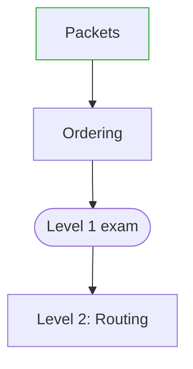

# PATH.md Format

`PATH.md` lives at the course root. The node sections are the record. The
Mermaid fence under `## Map` is rebuilt from those sections. Do not keep a
second file in sync. [SKILL.md](./SKILL.md) says when to write the path; this
file is the schema.

## Template

````md
# Path: {Topic}

## Map



## Level 1 — {Title}
status: open

### n1 {Title}
- kind: concept
- status: ready
- requires:
- source: [{title}](url)
- due:
- page:

### n3 {Title}
- kind: exam
- status: locked
- requires: n1, n2
- source: [{title}](url)
- due:
- page:
- override:

## Level 2 — {Title}
status: sketched

- {title}
- {title}
- Exam
````

## Rules

- Ids are `n1`, `n2`, … assigned once, never reused or renumbered. Exam nodes use the same sequence.
- `kind` is `concept`, `practice`, or `exam`. There is no `quiz` kind. A quiz is the chat check that sets a concept or practice node to `passed`.
- `status` is `locked`, `ready`, `in-progress`, or `passed`.
- Empty `requires` means the node may be `ready`. Otherwise it is `ready` only when every listed id is `passed`.
- At most one node is `in-progress`.
- A full node (any `###` under an open level) has a `source` that already appears in `RESOURCES.md`. A sketched level has no `###` nodes and no ids.
- `page` is a course-relative path or empty. `override` is empty or `user`, and only on an exam.
- On every write, and at the start of every session before teaching, replace the whole Map fence from the sections. One Mermaid node per `###`. The label is the heading title. Stadium shape for `exam` (`n3(["title"])`). One edge for each id in `requires`. `classDef passed stroke:#2a2`, and `class <id> passed` on every passed node. Each sketched level is one node `L{N}["Level {N}: {title}"]`. Edge it from the previous level's exam if that exam exists, otherwise from the previous sketched node.
- At session open, before that rebuild: if a node's status is `locked` and every id in `requires` is `passed`, set it to `ready`. Do not change `passed` or `in-progress` during that pass.
- When the last concept or practice node of the open level becomes `passed`, set the exam `due` to the next calendar day. Do not start that exam while the session date is before `due`, unless `override: user`.
- Exam failure: set the exam back to `ready`. Set each implicated node, and any same-level node that requires an implicated node, from `passed` or `in-progress` back to `ready`. Leave other levels alone.
- Expanding a level deletes its title bullets, writes `###` nodes with sources, sets `status: open` on that level, and sets `status: closed` on the previous level only after its exam is `passed`. Rebuild the map. Show the map and wait before teaching.
